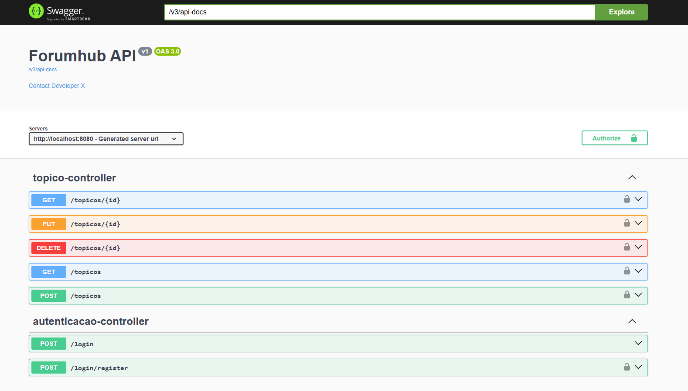

# forum-hub

O Forum Hub é um desafio proposto pela alura na finalização da sua trilha de java + spring boot 3.

Esse projeto é uma api restful para um fórum fictício, onde temos endpoints para o crud de tópicos e outras funcionalidades,
tudo isso seguindo as regras de negócio estimadas no ínicio do projeto.

## Índice

- [Endpoints](#Endpoints)
- [Tecnologias utilizadas](#Tecnologias-utilizadas)

## Endpoints

Atualmente temos 5 endpoints no projeto:

- [GET] -> "/topicos", para listar todos os tópicos;
- [GET] -> "/topicos/{id}", para detalhar um tópico específico, tendo acesso também a suas respostas;
- [POST] -> "/topicos", para criar um novo tópico;
- [PUT] -> "/topicos/{id}", para alterar as informações de um tópico;
- [DELETE] -> "/topicos/{id}", para deletar um tópico do banco de dados.

## Tecnologias utilizadas

- Java 21
- Spring Boot 3
- Lombok
- MySql 
- JWT
- Flyway
- SpringDoc 3
- IntelliJ IDEA
- Postman

## Como implementar

1 - Faça o clone do repositório ou o baixe;

2 - Crie o banco de dados que deseja armazenar os dados;

3 - Verifique o arquivo applications.properties e crie variáveis de ambiente condizentes com as presentes nesse arquivo;

4 - Rode o projeto, isso fará com que as migrations sejam executadas e seu banco esteja pronto para uso;
 
5 - Faça as requisições por meio de alguma ferramenta de sua preferência.

5.1 - Há a possibilidade de verificar e realizar as requisições da api utilizando a documentação do projeto através do caminho "/swagger-ui.html".

